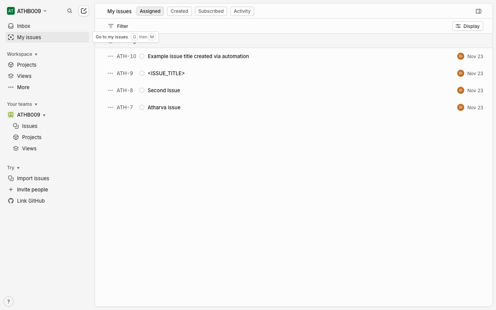
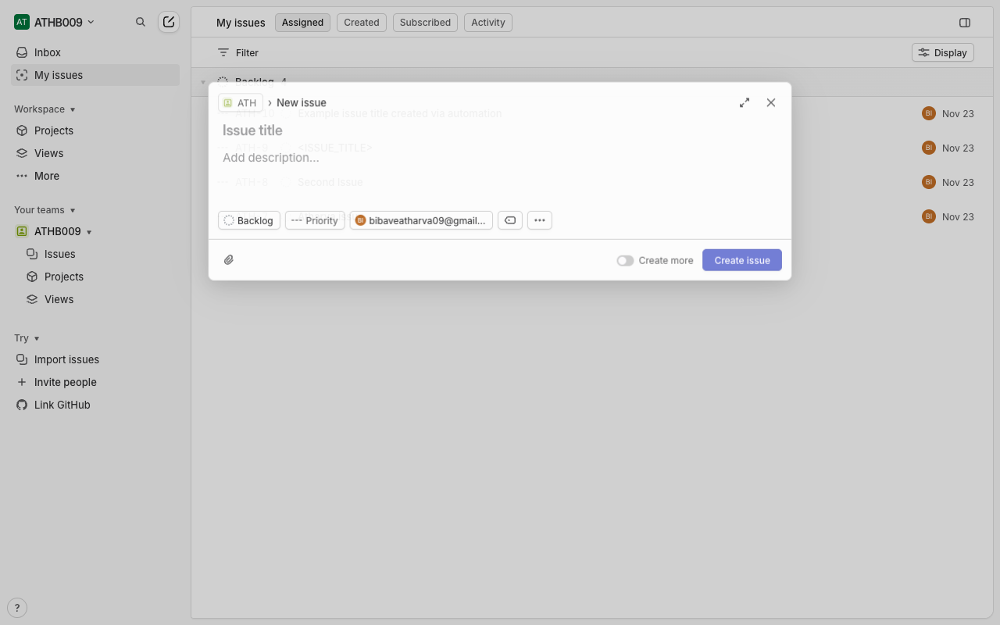
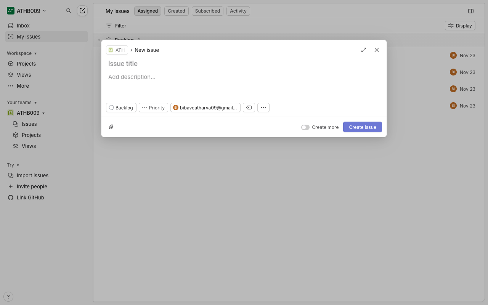
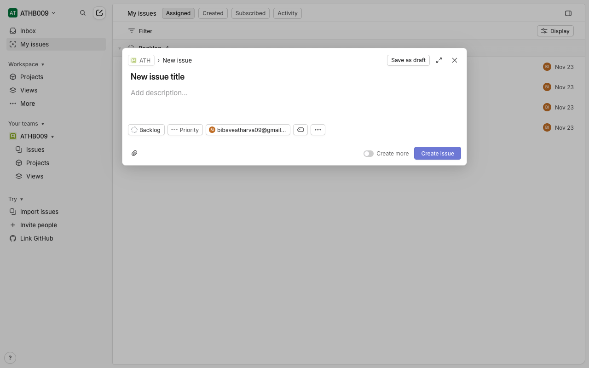
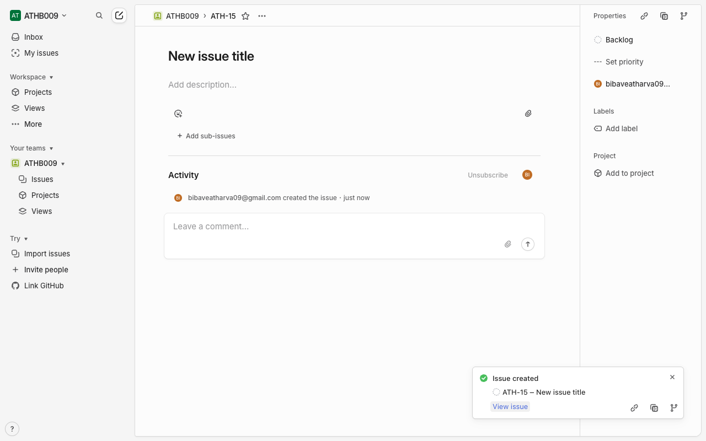
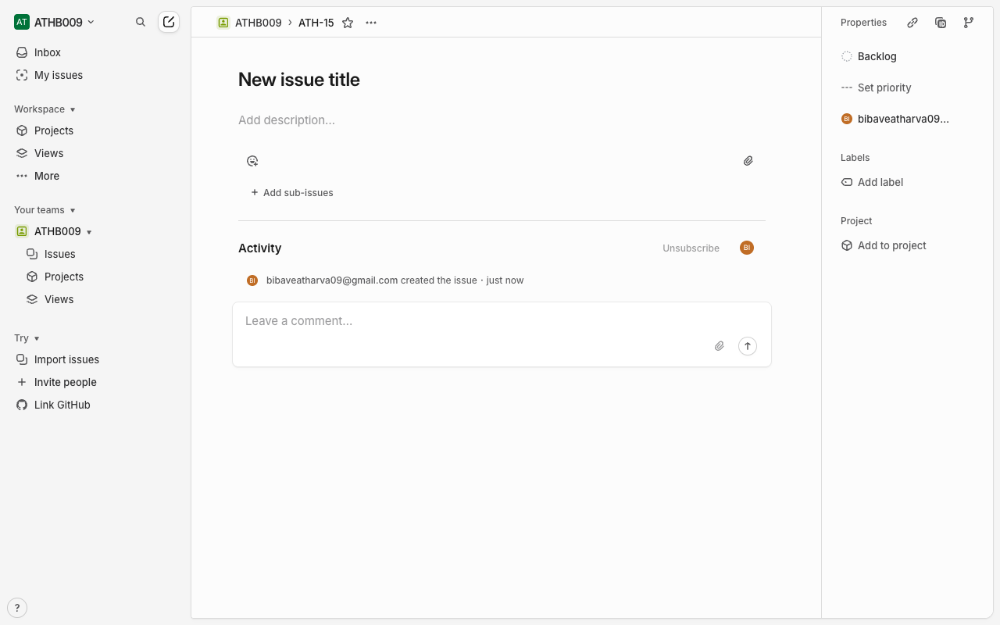

# How-To Guide: How do I create a new issue in Linear?

### Step 1: Open the Linear main app page to ensure you are in the workspace where you want to create the issue.
**Action:** `navigate` | **Target:** `None`

---

### Step 2: Open the Issues view so the issue will be created in the correct team/context.
**Action:** `click` | **Target:** `None`

---

### Step 3: Wait for the Issues list to fully load before opening the new issue dialog.
**Action:** `wait` | **Target:** `None`

---

### Step 4: Open the new issue modal using Linear’s shortcut (preferred and most reliable).
**Action:** `keyboard_shortcut` | **Target:** `None`

---

### Step 5: Wait for the new issue modal’s contenteditable title field to be ready.
**Action:** `wait` | **Target:** `None`

---

### Step 6: Focus the issue title field (which is a contenteditable element, not a standard input).
**Action:** `click` | **Target:** `None`

---

### Step 7: Type the new issue title into the contenteditable title field.
**Action:** `type` | **Target:** `None`

---

### Step 8: Confirm creation of the issue by clicking the Create issue button in the modal.
**Action:** `click` | **Target:** `None`

---

### Step 9: Wait for the modal to close and the new issue to appear in the issues list.
**Action:** `wait` | **Target:** `None`

---

