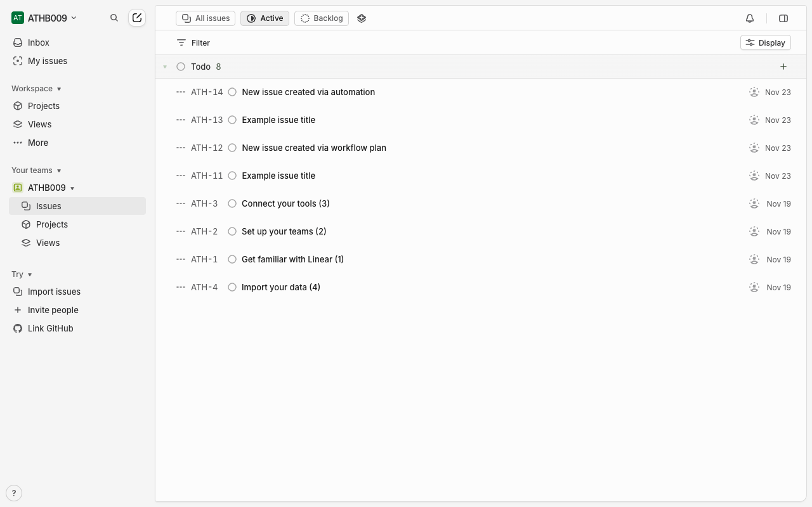
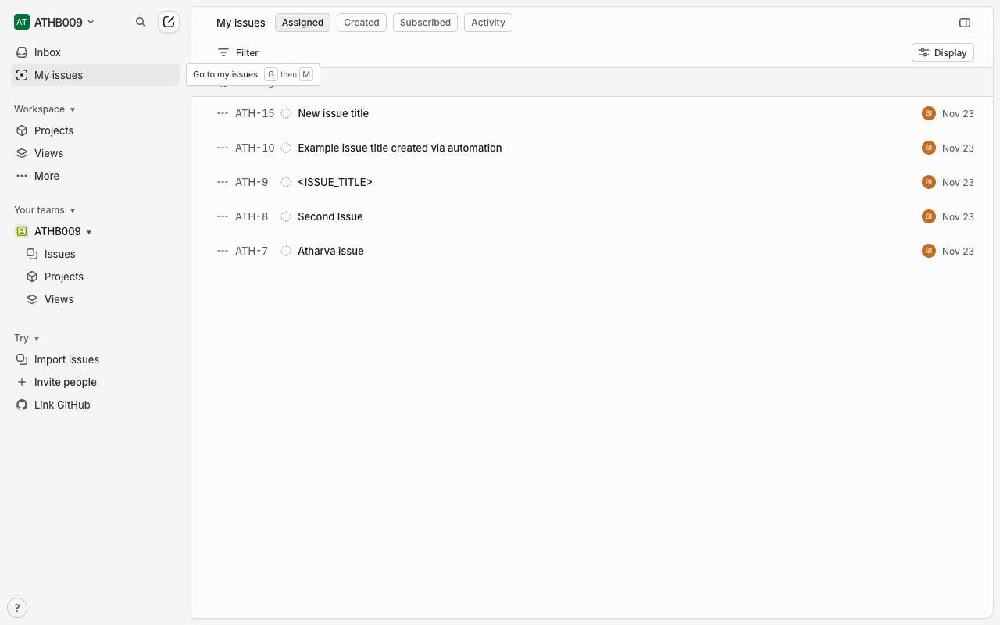
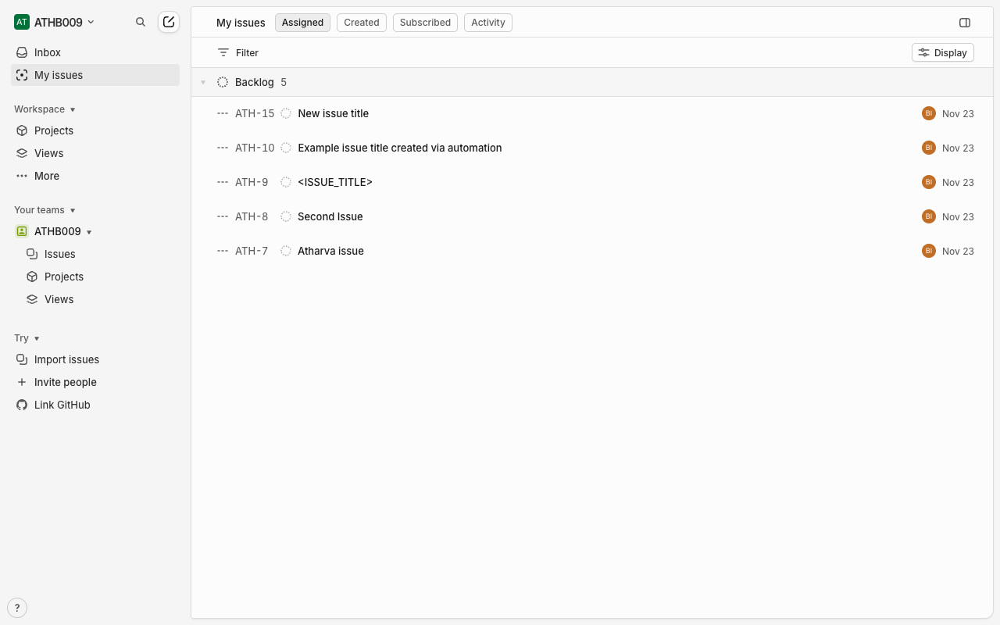

# How-To Guide: How do I view my assigned issues in Linear?

### Step 1: Open the main Linear workspace so you can access the Issues section.
**Action:** `navigate` | **Target:** `None`

---

### Step 2: Go to the main Issues page from the sidebar/navigation.
**Action:** `click` | **Target:** `None`

---

### Step 3: Wait for the Issues page and its controls (including My Issues) to fully load.
**Action:** `wait` | **Target:** `None`

---

### Step 4: Switch the view to show only issues assigned to you by using the My Issues control.
**Action:** `click` | **Target:** `None`

---

### Step 5: Wait for the My Issues list to refresh and display only issues assigned to you.
**Action:** `wait` | **Target:** `None`

---

### Step 6: Scroll through the My Issues list to review all issues assigned to you.
**Action:** `scroll` | **Target:** `None`

---

