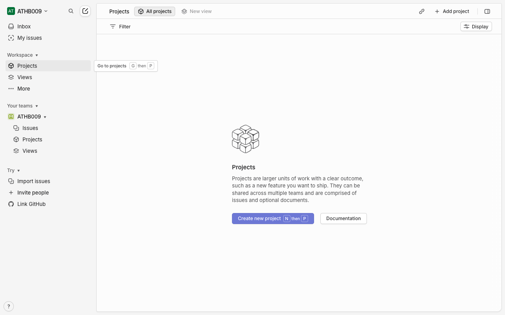

# How-To Guide: How do I navigate to Projects in Linear?

### Step 1: Open the Linear workspace home page directly to ensure you’re on the main app interface before navigating to Projects.
**Action:** `navigate` | **Target:** `None`

---

### Step 2: Wait for the main navigation sidebar to fully load so that the Projects link is available.
**Action:** `wait` | **Target:** `None`

---

### Step 3: Click the Projects item in the main navigation to open the Projects view.
**Action:** `click` | **Target:** `None`

---

### Step 4: Wait for the Projects page content to finish loading so all projects and controls are visible.
**Action:** `wait` | **Target:** `None`

---

