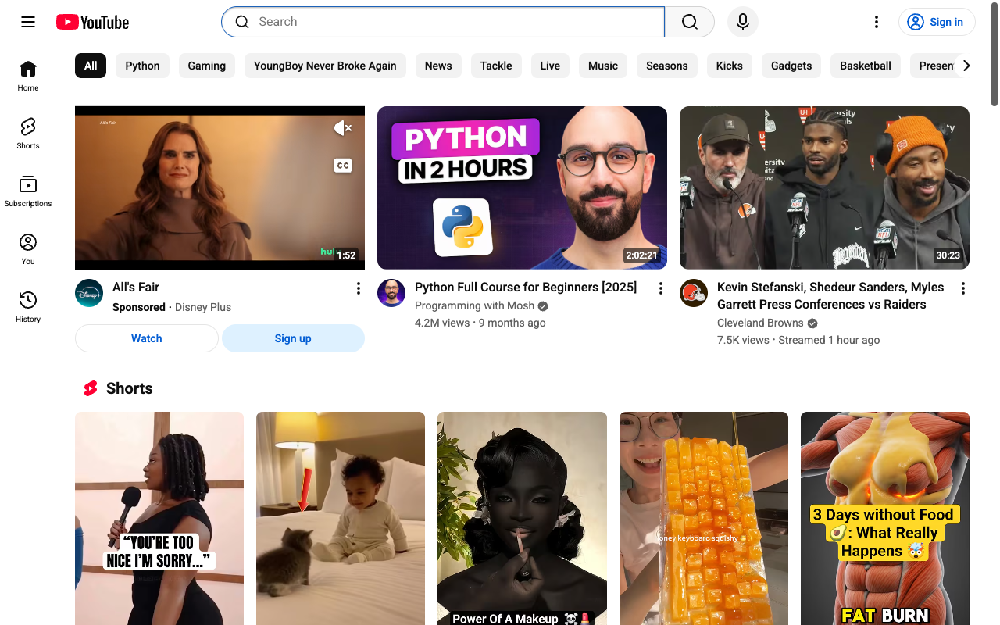
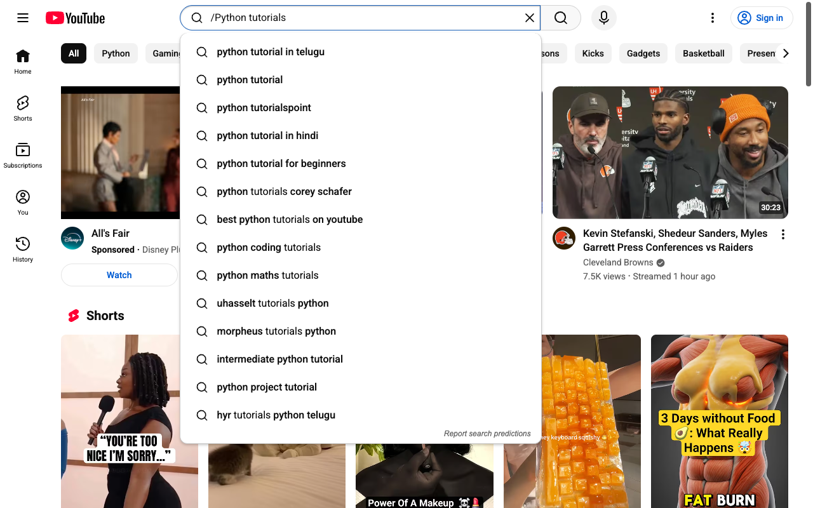
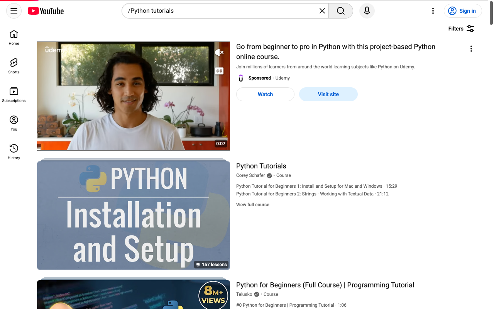
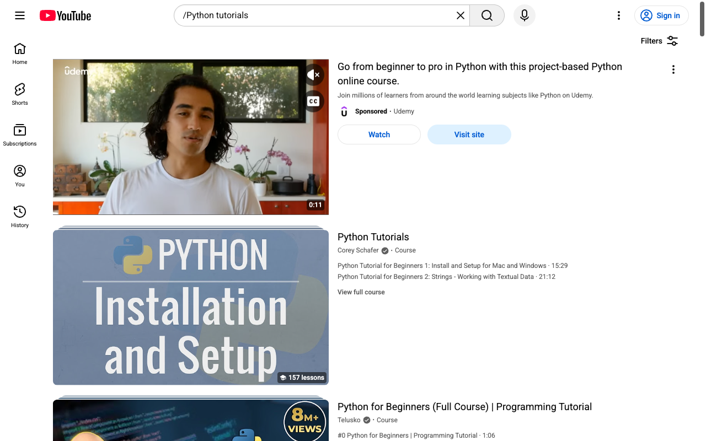
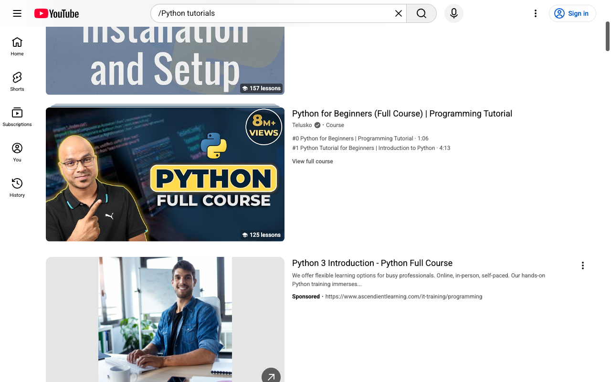
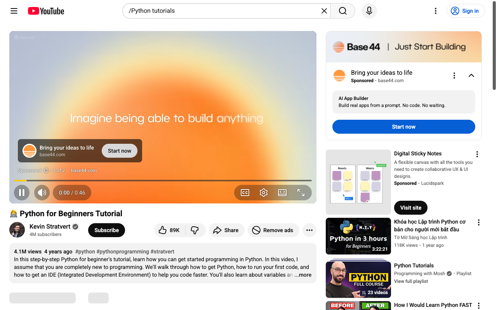

# How-To Guide: How do I search for 'Python tutorials' on YouTube?

### Step 1: Go directly to the YouTube home page using the base URL.
**Action:** `navigate` | **Target:** `None`

---

### Step 2: Wait for the YouTube main interface and top search bar to finish loading.
**Action:** `wait` | **Target:** `None`

---

### Step 3: Focus the search input box so we can type our query.
**Action:** `click` | **Target:** `None`

---

### Step 4: Type the search query 'Python tutorials' into the search box.
**Action:** `type` | **Target:** `None`

---

### Step 5: Submit the search by clicking the search button next to the input field.
**Action:** `click` | **Target:** `None`

---

### Step 6: Wait for the search results page to load, showing videos related to 'Python tutorials'.
**Action:** `wait` | **Target:** `None`

---

### Step 7: Scroll down slightly to ensure multiple search results for 'Python tutorials' are visible.
**Action:** `scroll` | **Target:** `None`

---

### Step 8: Optionally open one of the visible 'Python tutorials' videos from the results list.
**Action:** `click` | **Target:** `None`

---

### Step 9: Wait for the selected video page to load and begin playing the Python tutorial.
**Action:** `wait` | **Target:** `None`

---

