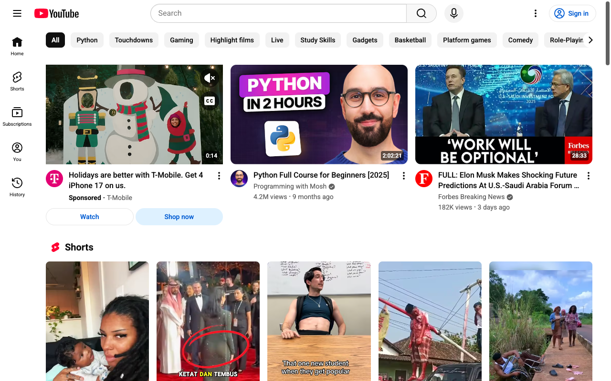
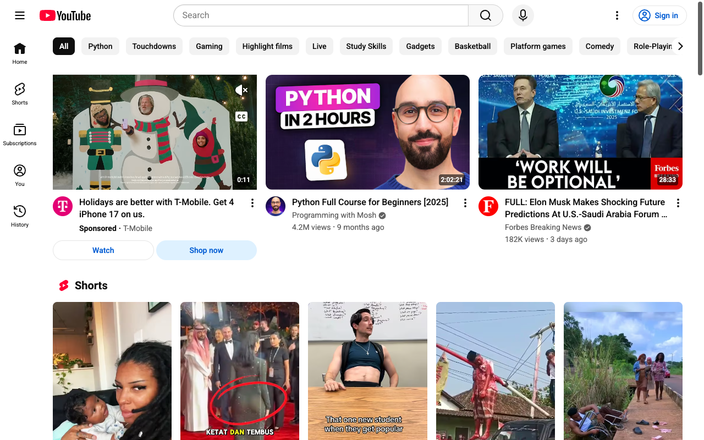
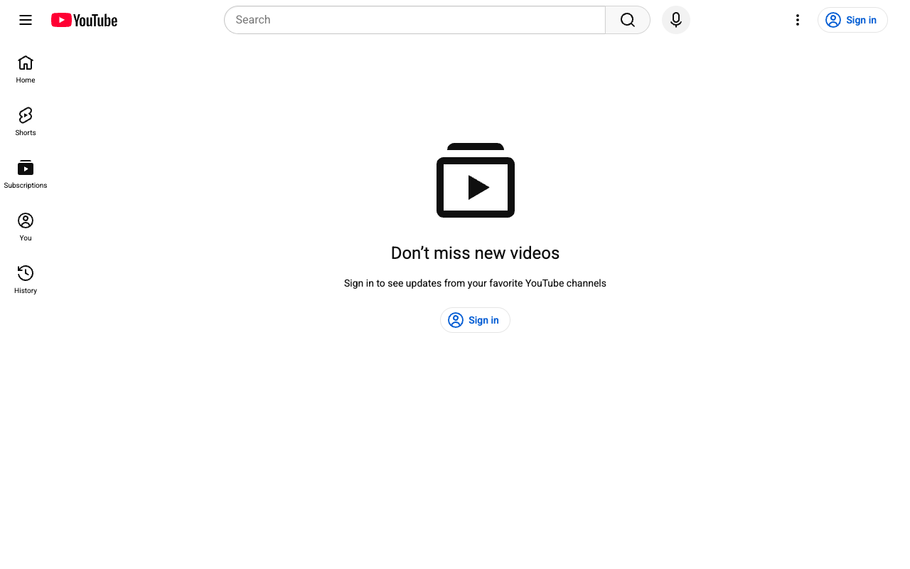
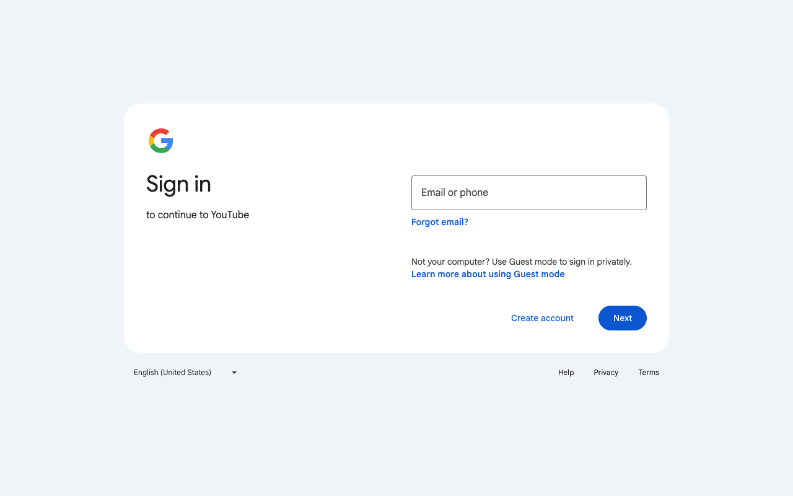
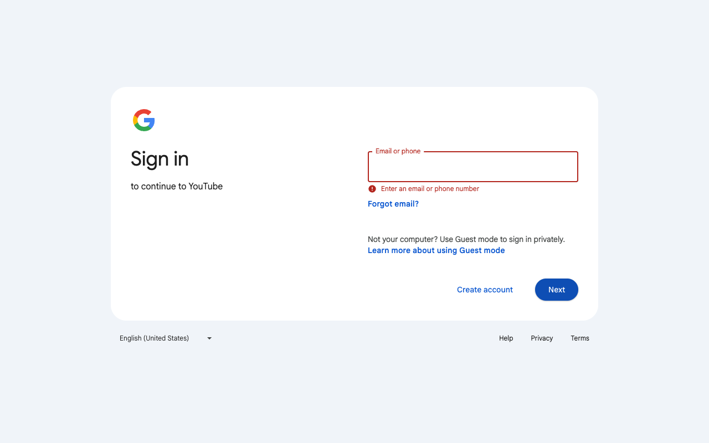

# How-To Guide: How do I view my YouTube subscriptions page?

### Step 1: Open the main YouTube homepage so you can access the sidebar and navigation links.
**Action:** `navigate` | **Target:** `None`

---

### Step 2: Wait for the YouTube homepage and sidebar to fully load before interacting with navigation links.
**Action:** `wait` | **Target:** `None`

---

### Step 3: Click the 'Subscriptions' link in the left sidebar to go to your subscriptions feed.
**Action:** `click` | **Target:** `None`

---

### Step 4: Wait for the Subscriptions page to finish loading, including the list of subscribed channels' videos.
**Action:** `wait` | **Target:** `None`

---

### Step 5: Scroll down to confirm that your subscriptions feed is populated with videos from channels you follow.
**Action:** `scroll` | **Target:** `None`

---

