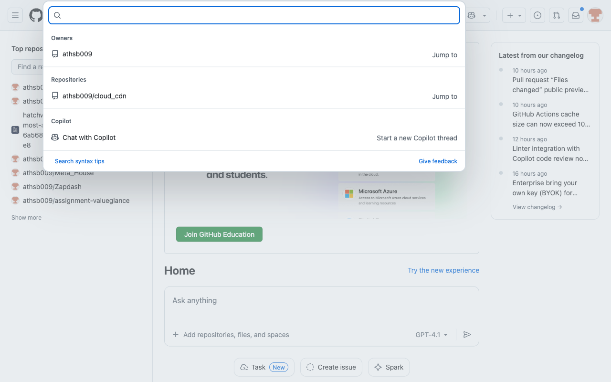

# How-To Guide: How do I find repositories about 'machine learning' on GitHub?

### Step 1: Open the GitHub homepage to start the search.
**Action:** `navigate` | **Target:** `None`

---

### Step 2: Focus the GitHub search box using the built-in keyboard shortcut.
**Action:** `keyboard_shortcut` | **Target:** `None`

---

### Step 3: Enter the search query for machine learning repositories into the focused search field.
**Action:** `type` | **Target:** `None`

---

### Step 4: Submit the search query to see results for machine learning on GitHub.
**Action:** `press_enter` | **Target:** `None`

---

### Step 5: Wait for the search results page and filters to fully load.
**Action:** `wait` | **Target:** `None`

---

### Step 6: Filter the search results to show only repositories related to machine learning.
**Action:** `click` | **Target:** `None`

---

### Step 7: Allow the repository results list to render after applying the filter.
**Action:** `wait` | **Target:** `None`

---

### Step 8: Scroll through the repository results to review more machine learning repositories.
**Action:** `scroll` | **Target:** `None`

---

### Step 9: Open a specific repository related to machine learning from the results list.
**Action:** `click` | **Target:** `None`

---

