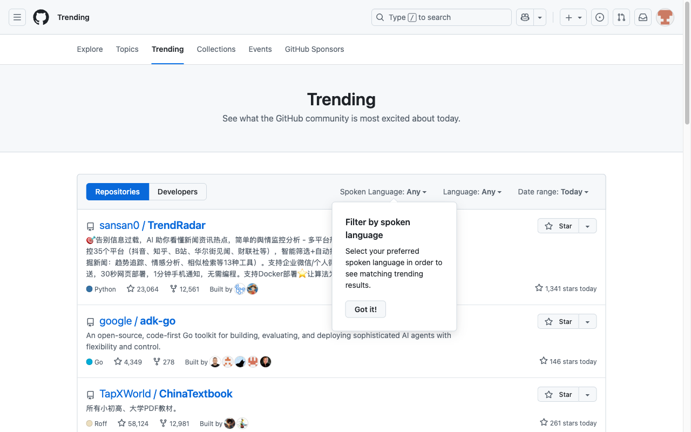

# How-To Guide: How do I navigate to the Trending page on GitHub?

### Step 1: Open the GitHub homepage using the provided base URL.
**Action:** `navigate` | **Target:** `None`

---

### Step 2: Wait for the main navigation/header to fully load before interacting.
**Action:** `wait` | **Target:** `None`

---

### Step 3: Open the Trending page by clicking the trending link in the navigation or footer if available.
**Action:** `click` | **Target:** `None`

---

### Step 4: Wait for the Trending page content (repository list and filters) to fully load.
**Action:** `wait` | **Target:** `None`

---

