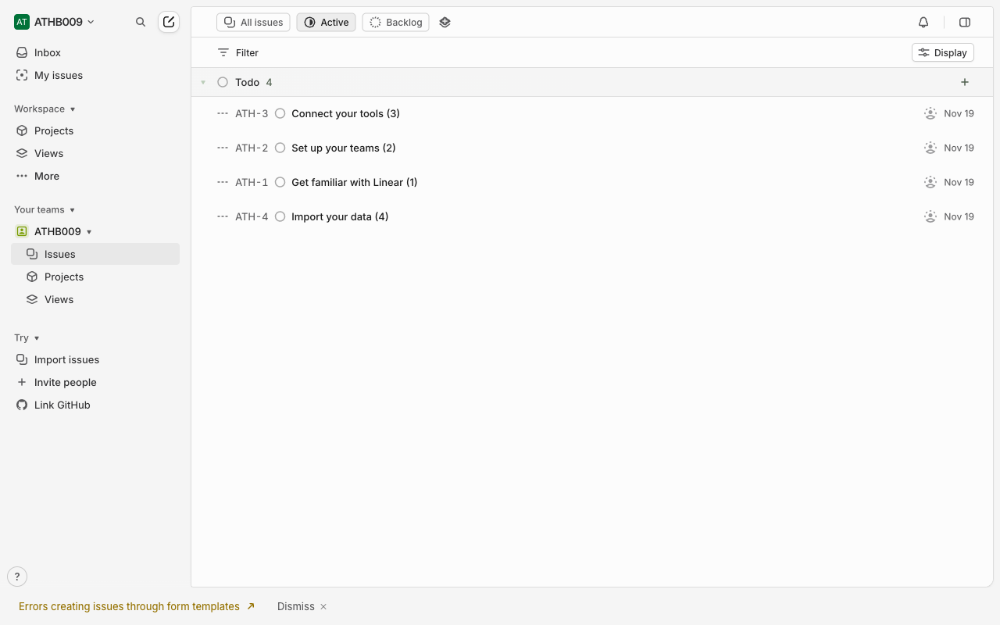
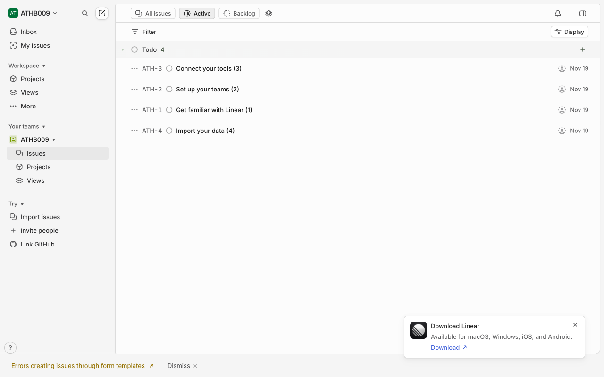
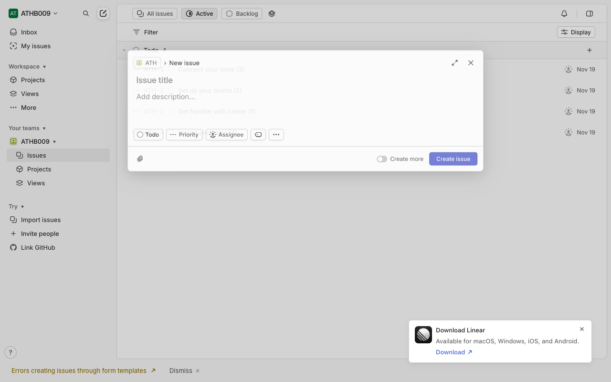
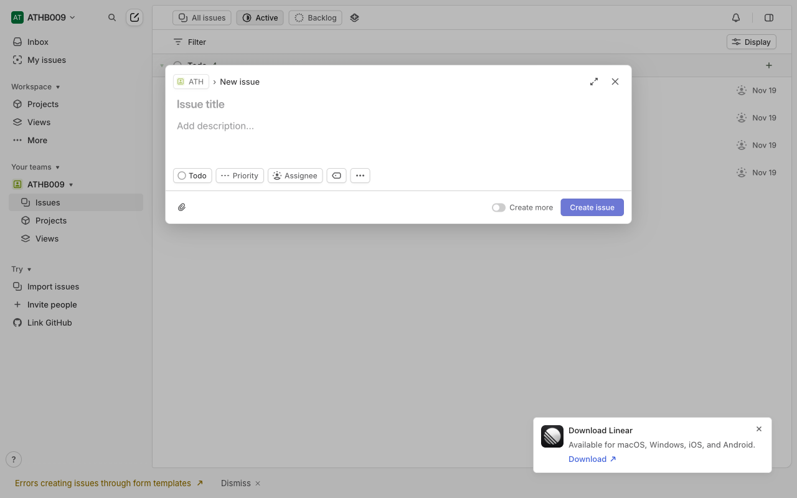
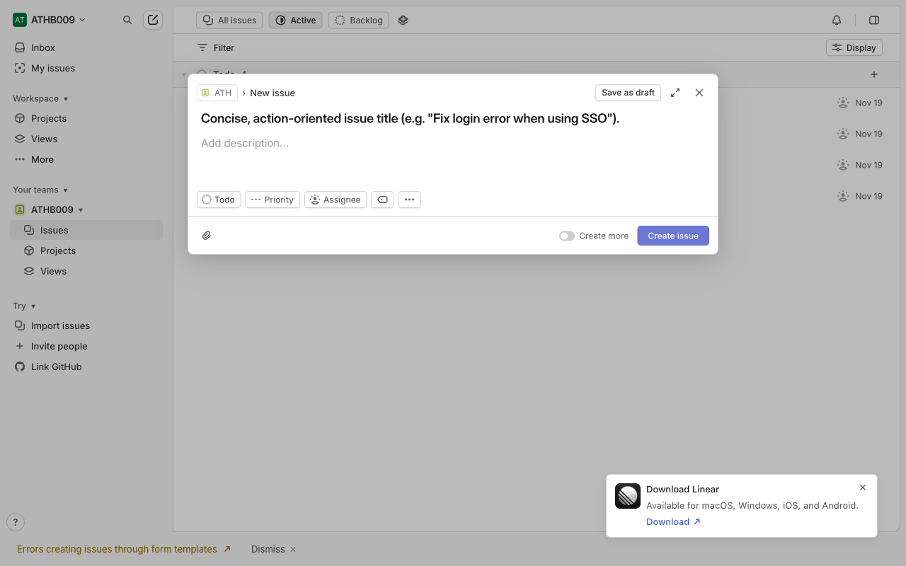
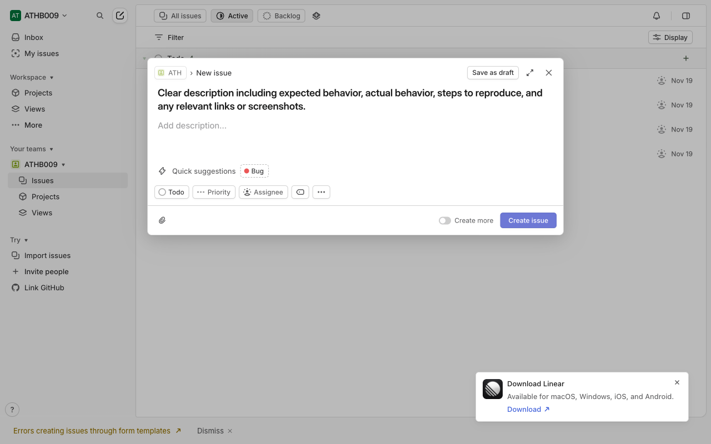
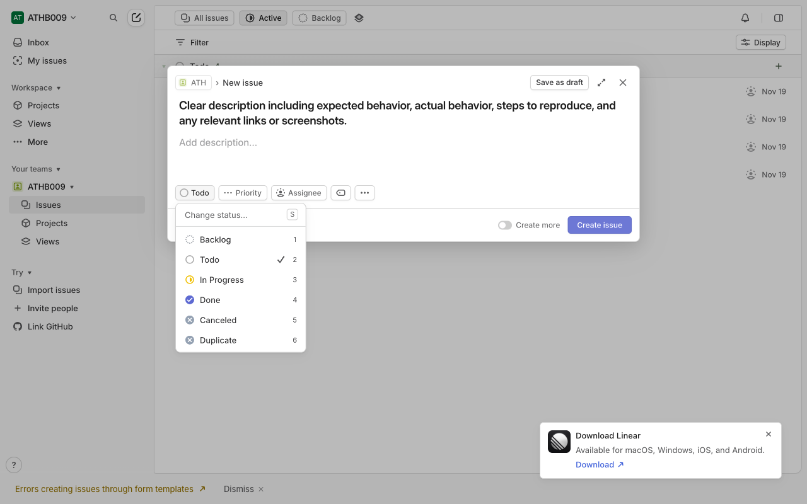
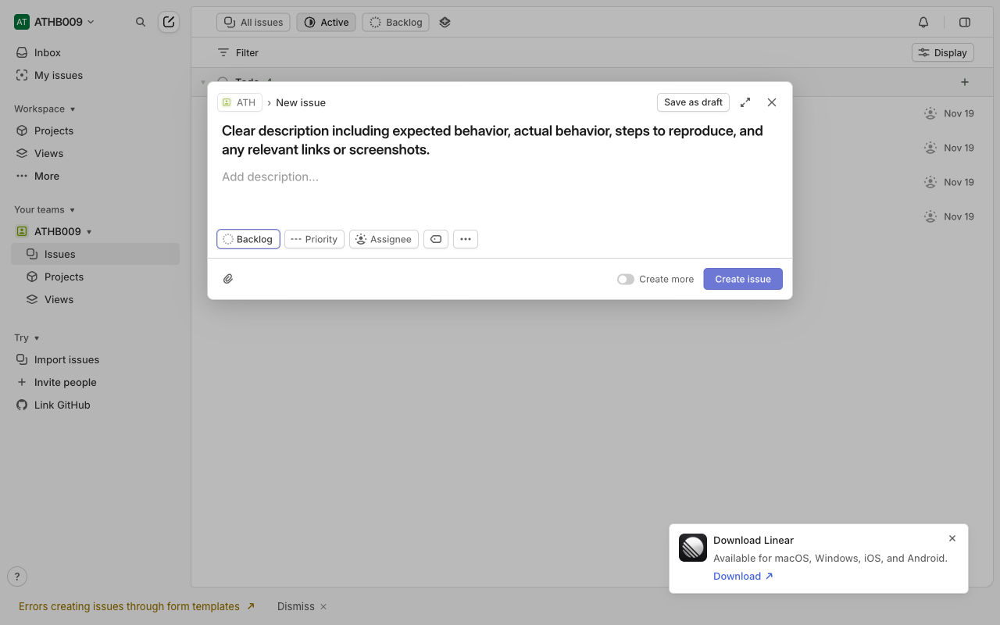

# How-To Guide: How do I create new issuesin Linear?

### Step 1: Open Linear’s main web app where you can view teams and issues.
**Action:** `navigate` | **Target:** `None`

---

### Step 2: Wait for the Linear app (or login page) to fully load before interacting.
**Action:** `wait` | **Target:** `None`

---

### Step 3: If not already logged in, authenticate into your Linear workspace.
**Action:** `click` | **Target:** `None`

---

### Step 4: Wait for the main workspace UI to load after login.
**Action:** `wait` | **Target:** `None`

---

### Step 5: Open a specific team or project where you want to create the new issue (optional but recommended for correct team assignment).
**Action:** `click` | **Target:** `None`

---

### Step 6: Open the New Issue dialog using the visible New Issue button.
**Action:** `click` | **Target:** `None`

---

### Step 7: Alternative way to open the New Issue composer using the keyboard shortcut.
**Action:** `keyboard_shortcut` | **Target:** `None`

---

### Step 8: Wait for the New Issue modal or composer to be fully ready for input.
**Action:** `wait` | **Target:** `None`

---

### Step 9: Enter the issue title into the title field.
**Action:** `type` | **Target:** `None`

---

### Step 10: Enter a detailed description of the issue.
**Action:** `type` | **Target:** `None`

---

### Step 11: Set or adjust issue metadata such as status, assignee, or labels using the status dropdown (or similar controls).
**Action:** `click` | **Target:** `None`

---

### Step 12: Choose the desired status (or other selected metadata option) for the issue.
**Action:** `click` | **Target:** `None`

---

### Step 13: Create the issue by saving/submitting the New Issue form.
**Action:** `click` | **Target:** `None`

---

### Step 14: Wait for the issue list to refresh and show the newly created issue.
**Action:** `wait` | **Target:** `None`

---

### Step 15: Open the newly created issue from the list to confirm its details.
**Action:** `click` | **Target:** `None`

---

