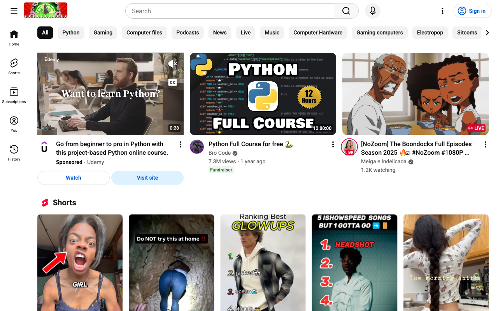
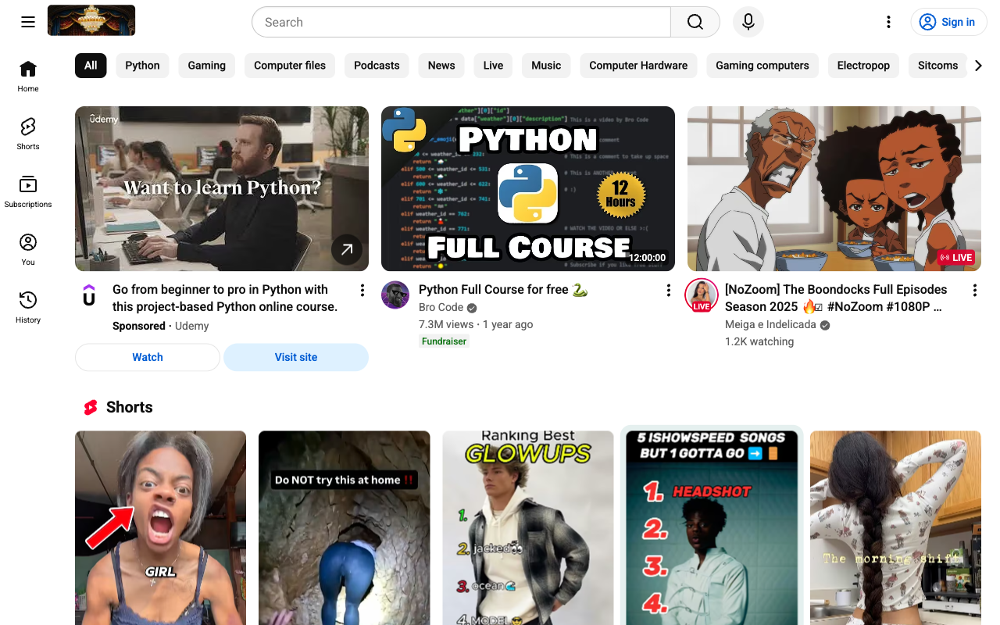
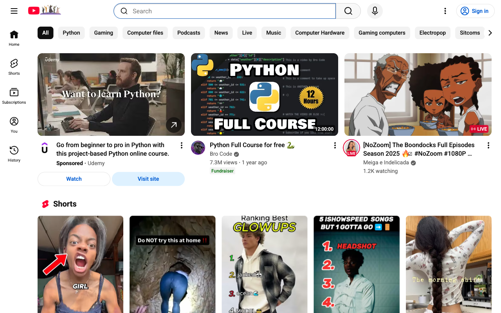
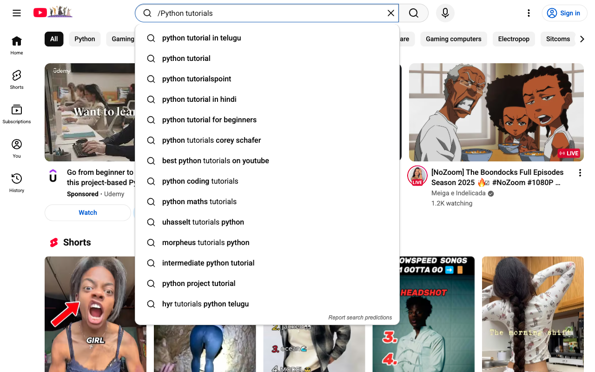
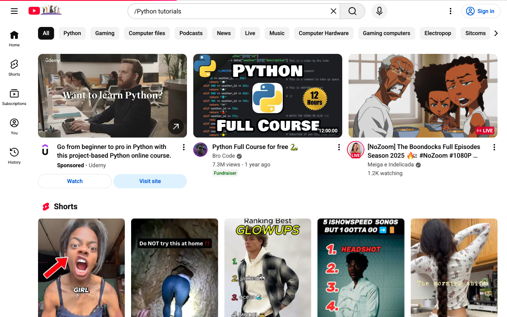
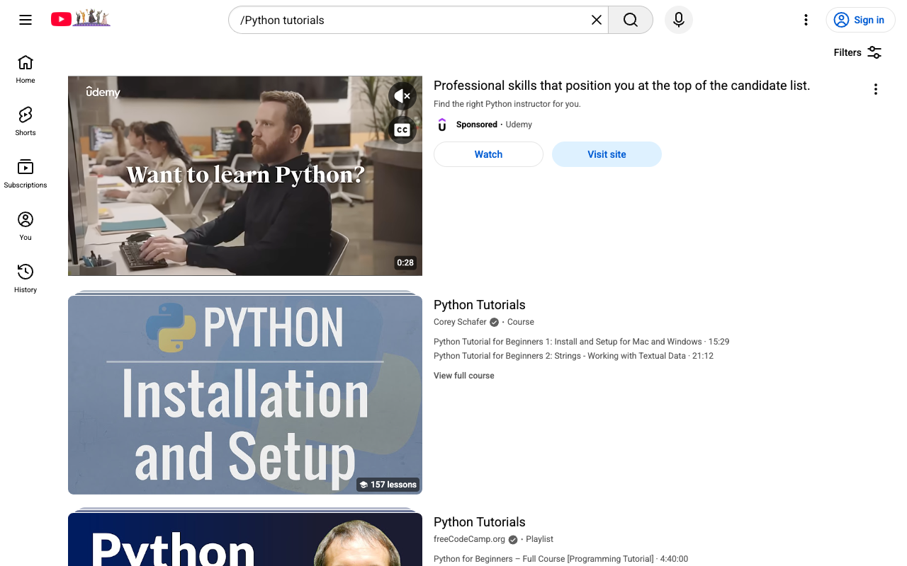
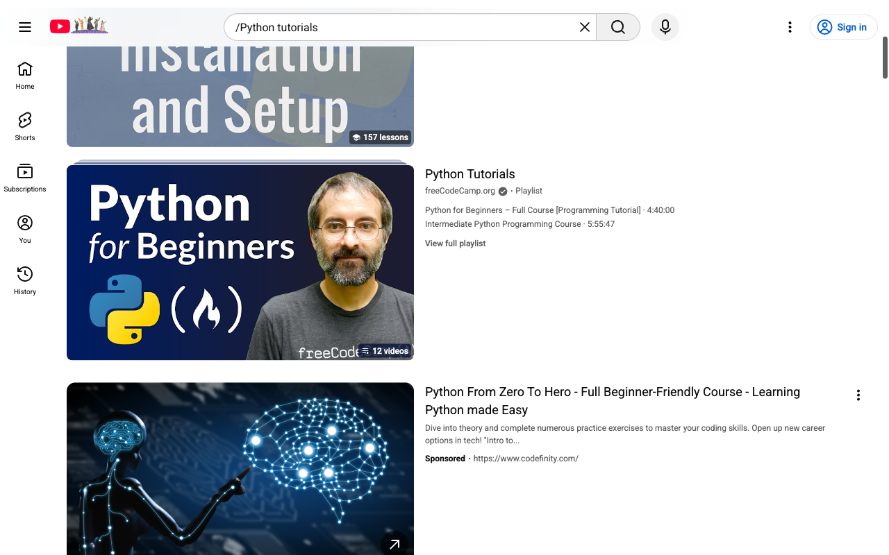
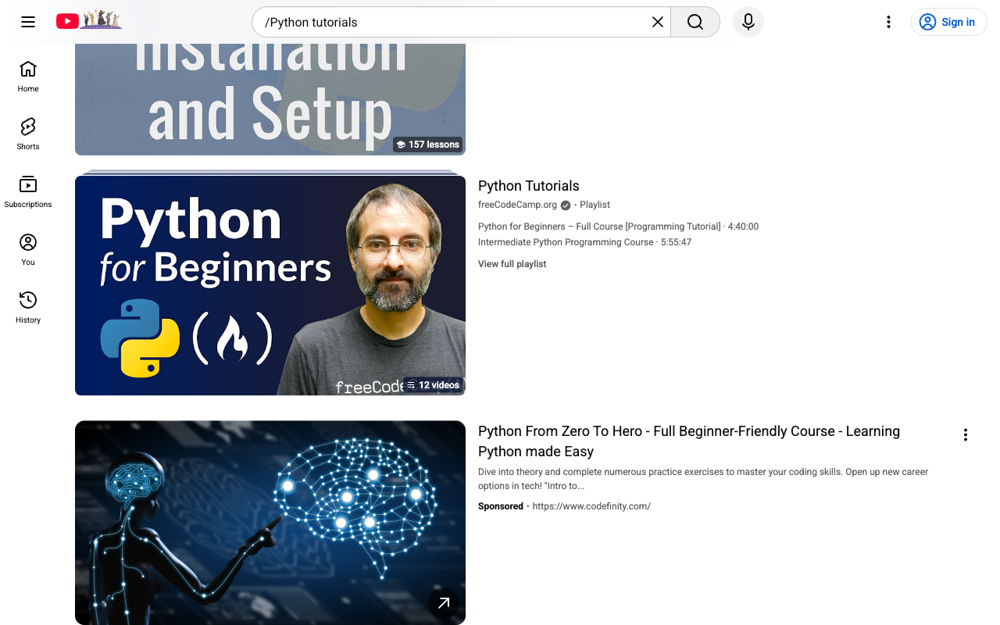

# How-To Guide: How do I search for 'Python tutorials' on YouTube?

### Step 1: Open the YouTube homepage in a new browser tab or window.
**Action:** `navigate` | **Target:** `None`

---

### Step 2: Wait for the YouTube homepage to fully load, including the search box and navigation bar.
**Action:** `wait` | **Target:** `None`

---

### Step 3: Focus the search box where you can type your query.
**Action:** `click` | **Target:** `None`

---

### Step 4: Enter the search query 'Python tutorials' into the search box.
**Action:** `type` | **Target:** `None`

---

### Step 5: Submit the search query using the Enter key. This is the primary method to start the search.
**Action:** `press_enter` | **Target:** `None`

---

### Step 6: If pressing Enter fails, click the search button (magnifying glass icon) to submit the query as a fallback.
**Action:** `click` | **Target:** `None`

---

### Step 7: Wait for the search results page for 'Python tutorials' to fully load.
**Action:** `wait` | **Target:** `None`

---

### Step 8: Scroll through the search results to view more 'Python tutorials' videos.
**Action:** `scroll` | **Target:** `None`

---

### Step 9: Optional: Use the browser's find shortcut to confirm that 'Python tutorials' appears on the page (for validation).
**Action:** `keyboard_shortcut` | **Target:** `None`

---

